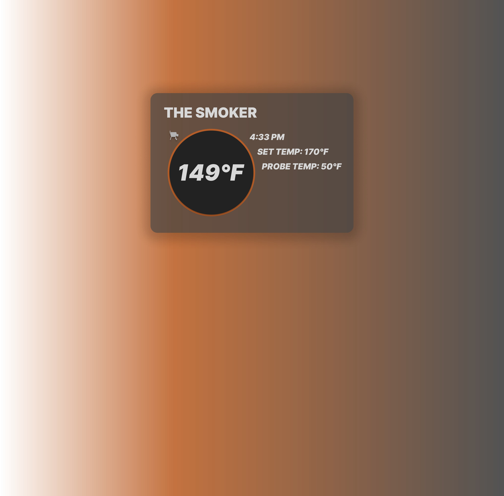

# Traeger-WebUI

## Overview
Hey what's up. Traeger doesn't have a web interface that let's us monitor our grills. So I'm making it myself. FullStack everything (Nuxt.js, Vue.js, Node.js, Express.js, Tailwind, Vercel, FireBase (auth)), even UI/UX design (Figma, Photoshop). The goal is to provide an intuitive and user-friendly way to monitor and interact with a Traeger Grill via the web because I'm not a fan of their official mobile app. Stay tooned because I'm really close to having an MVP ready.

## UI/UX Design
For detailed information on the UI/UX design of the PyTraeger-WebUI, refer to this dope Figma design I cooked up. 

## Features
- User-friendly web interface
- Real-time data visualization
- Easy configuration and management of Traeger settings
- Responsive design for use on various devices

## License
This project is licensed under the MIT License. See the [LICENSE](LICENSE) file for more details.

## Contact
For any questions or inquiries, contact me at w.barayuga@u.pacific.edu